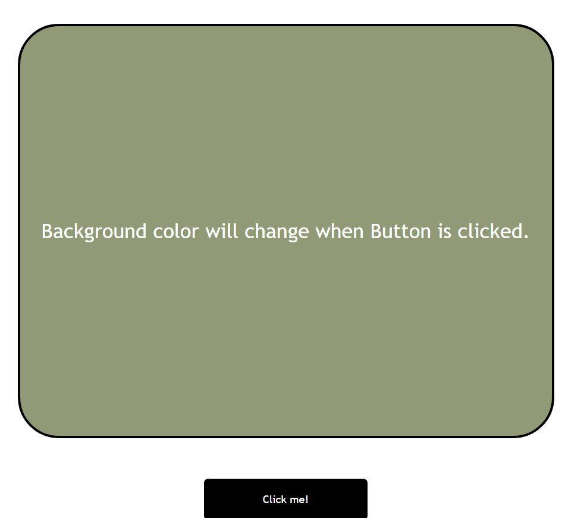

# ⭐ Project - BackgroundColor Changer ⭐

This  project of javascript is made from pure HTML,CSS and Javascript.

 

📌 Learnings:

👉 1\. HTML, CSS and DOM Manipulation 
👉 2\. How to generate random Hexadecimal color code. 

 

> Time taken to build this project is 20 min.

  

## Links

[Link](https://javascriptcolorchanger.netlify.app/)

[Linkedin](https://www.linkedin.com/in/pratyush-kesarwani-2b6601171/)

### Acknowledgements:

I am thankful to Hitesh Choudhary sir, Anurag sir and iNeuron team for this amazing bootcamp.
